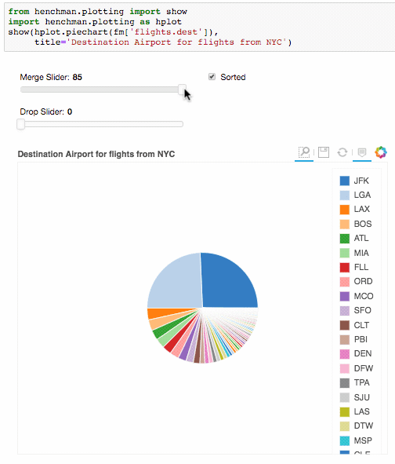
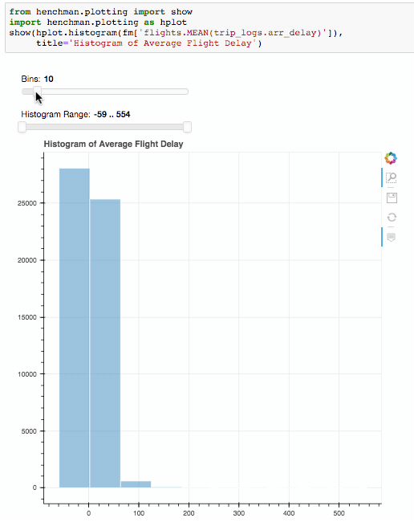
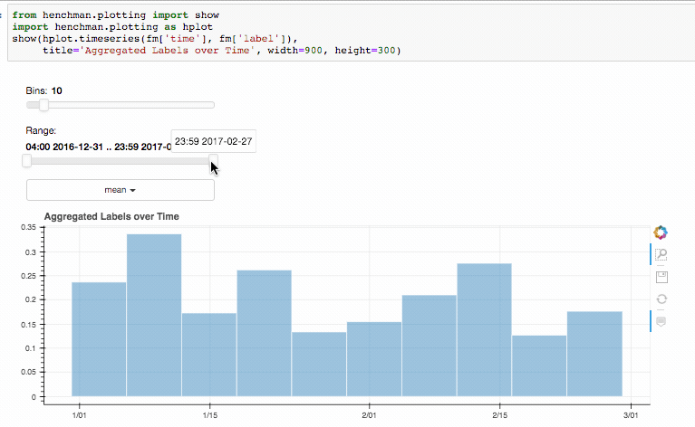
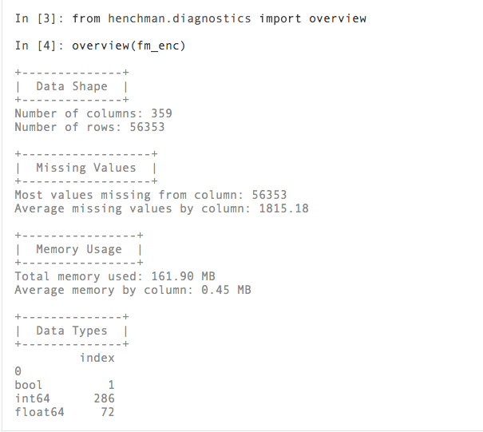
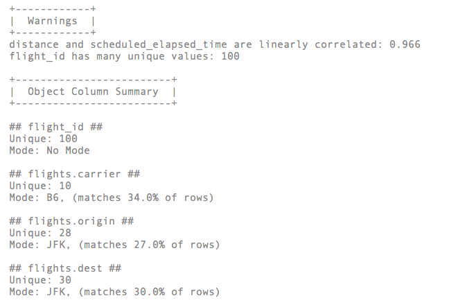
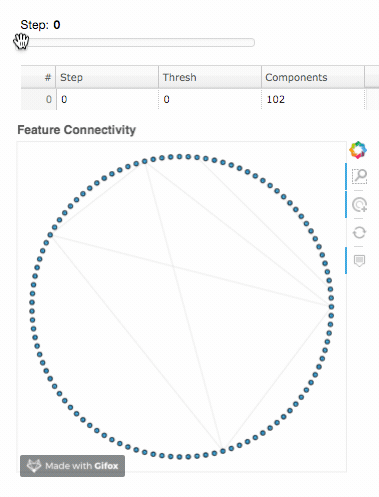

Welcome to Henchman! 
===================== 

Henchman is a collection of `open source
<https://github.com/featurelabs/henchman>`_ python utility
functions for working in a jupyter notebook. With Henchman,
you can rapidly prototype end-to-end data science workflows.
You can explore data with :ref:`diagnostics`, make
interesting plots with :ref:`plotting`, and do feature
selection and machine learning with :ref:`selection` and
:ref:`learning`.

Why?
~~~~~

Life is full of reusable functions. Here's what separates
Henchman:

- **Easy Interactive Plotting**: We bypass the flexible Bokeh
  API in favor of a small, rigid collection of standard data
  analysis plots. With sliders and checkboxes, finding the
  right plot parameters is as easy as a single function call.

- **Memorable API, Extensive documentation**: We have a
  heavy emphasis on ease of use. That means all the
  functions are sorted into one of 4 semantically named
  modules and names should be easy to remember inside that
  module. Additionally, every function has a docstring, an
  example and a documentation page.

.. image:: img/create_model_docs.png
   :width: 75%
   :align: center

- **Novel Functionality**: We provide a few functions built
  from scratch to add to your data science workflow. There
  are methods to systematically find dataset attributes with
  :func:`henchman.diagnostics.overview` and :func:`henchman.diagnostics.warnings` from ``henchman.diagnostics`` and classes to
  select features in novel ways with :class:`RandomSelect <henchman.selection.RandomSelect>` and
  :class:`Dendrogram <henchman.selection.Dendrogram>` in ``henchman.selection``.

Install
========
To install Henchman, run this command in your terminal:

.. code-block:: console

    $ python -m pip install fl-henchman

If you are using conda, you can download the most recent build from our channel on Anaconda.org:

.. code-block:: console

    $ conda install -c featurelabs henchman

These are the preferred methods to install Henchman, as it will always install the most recent stable release. You can download miniconda `from this page`_.

.. _from this page: https://github.com/conda/conda

The sources for Henchman can be downloaded from the `Github repo`_.

You can either clone the public repository:

.. code-block:: console

    $ git clone git://github.com/featurelabs/henchman

Or download the `tarball`_:

.. code-block:: console

    $ curl  -OL https://github.com/featurelabs/henchman/tarball/master

Once you have a copy of the source, you can install it with:

.. code-block:: console

    $ python setup.py install

.. _Github repo: https://github.com/featurelabs/henchman
.. _tarball: https://github.com/featurelabs/henchman/tarball/master

